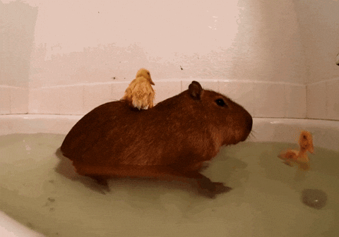

## Hi there 👋
#### 🔭 I’m currently working on ...computer science open learning on Github and free code camp while I work on debt consolidation
#### 📫 How to reach me: ... exotic.rainstorm@gmail.com
#### 💬 Ask me about ... Pre-veterinary school, aerial lyra, animals
#### ⚡ Fun fact: ... I'm in the first Deadpool movie 
#### 🌱 I’m currently learning ... How to use Github! Harvard CS50 / CS50P, Free Code Camp - Responsive Web Design / Javascript Algorithms & Data Structures.
#### 
 
### 

### 

### 
<!--
**sushiscroll/sushiscroll** is a ✨ _special_ ✨ repository because its `README.md` (this file) appears on your GitHub profile.

Here are some ideas to get you started:

- 🔭 I’m currently working on ...
- 🌱 I’m currently learning ...
- 👯 I’m looking to collaborate on ...
- 🤔 I’m looking for help with ...
- 💬 Ask me about ...
- 📫 How to reach me: ...
- 😄 Pronouns: ...
- ⚡ Fun fact: ...
-->
